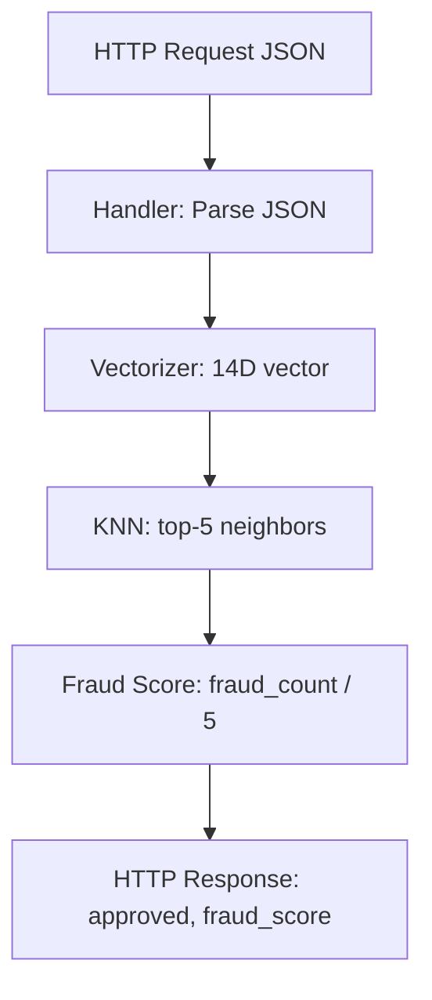

# fraudctl

High-performance fraud detection API using KNN vector search for credit card transactions.

## Overview

fraudctl is a Go-based API that detects fraudulent credit card transactions using KNN (K-Nearest Neighbors) vector search. It transforms transactions into 14-dimensional vectors and compares them against a reference dataset of 100k labeled transactions.

### Key Features

- **14D Vectorization**: Transaction features normalized to 14 dimensions
- **KNN Search**: Brute-force euclidean distance over 100k reference vectors
- **Fast Response**: Optimized KNN achieving ~0.85ms per prediction
- **Low Resource**: Runs on 1 CPU / 350 MB RAM total

## API Endpoints

| Endpoint | Method | Description |
|---------|--------|-------------|
| `/ready` | GET | Health check |
| `/fraud-score` | POST | Fraud detection |

### Request

```json
{
  "transaction": {
    "amount": 150.00,
    "installments": 3,
    "requested_at": "2024-01-15T10:30:00Z"
  },
  "customer": {
    "avg_amount": 100.00,
    "tx_count_24h": 5,
    "last_transaction": "2024-01-15T09:00:00Z"
  },
  "merchant": {
    "mcc": "5411",
    "is_online": false,
    "km_from_home": 10.5
  }
}
```

### Response

```json
{
  "approved": true,
  "fraud_score": 0.4
}
```

## Quick Start

### Docker Compose

```bash
docker compose up -d
```

Access the API at `http://localhost:9999`

### Build from Source

```bash
go build -o fraudctl ./cmd/api
./fraudctl
```

## Architecture



### 14 Dimensions

| Idx | Feature | Description |
|-----|---------|-------------|
| 0 | amount | Normalized transaction amount |
| 1 | installments | Number of installments |
| 2 | amount_vs_avg | Amount vs customer average |
| 3 | hour_of_day | Transaction hour (0-23) |
| 4 | day_of_week | Day of week (0-6) |
| 5 | minutes_since_last_tx | Time since last transaction |
| 6 | km_from_last_tx | Distance from last transaction |
| 7 | km_from_home | Distance from home |
| 8 | tx_count_24h | Transactions in last 24h |
| 9 | is_online | Online transaction flag |
| 10 | card_present | Card present flag |
| 11 | unknown_merchant | Unknown merchant flag |
| 12 | mcc_risk | MCC risk score |
| 13 | merchant_avg_amount | Merchant average amount |

## Performance

| Metric | Value |
|--------|-------|
| KNN Latency (100k) | ~0.85ms |
| HTTP Errors | 0% |
| Accuracy | 99.0% |
| p95 Latency | ~100ms (10 VUs) |

## CI/CD

GitHub Actions workflows for automated builds and releases:

- **build.yml**: Runs tests and builds binary
- **docker.yml**: Builds Docker image, pushes to Docker Hub, creates GitHub release

### Secrets Required

| Secret | Description |
|--------|------------|
| `DOCKERHUB_USERNAME` | Docker Hub login |
| `DOCKERHUB_TOKEN` | Docker Hub access token |
| `GIT_HUB_TOKEN` | GitHub PAT (contents:write) |

## Project Structure

```
fraudctl/
├── cmd/api/               # Main application
├── internal/
│   ├── handler/          # HTTP handlers
│   ├── knn/              # KNN search algorithm
│   ├── vectorizer/       # 14D vectorization
│   ├── dataset/          # Dataset loader
│   └── model/            # Data models
├── resources/             # Reference data
├── config/               # nginx configuration
├── test/                 # k6 load tests
├── Dockerfile
├── docker-compose.yml
└── PROJECT_PLAN.md       # Detailed project plan
```

## License

See [LICENSE](LICENSE) for details.

## Documentation

- [PROJECT_PLAN.md](PROJECT_PLAN.md) - Detailed project plan
- [docs/ARCHITECTURE.md](docs/ARCHITECTURE.md) - Architecture diagrams (Mermaid)
