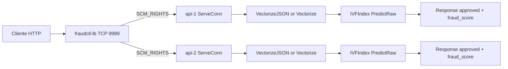

# fraudctl

API de detecção de fraude em Go para a Rinha de Backend 2026.

## Status Atual

- Runtime principal em Go puro com `fasthttp`
- Busca por similaridade com IVF KNN sobre `3_000_000` vetores de referência
- Balanceamento por um load balancer custom em Go com passagem de descritor de arquivo via `SCM_RIGHTS`
- Stack principal local: `2x API + 1x fraudctl-lb`
- Build principal da imagem gera `resources/ivf.bin` em tempo de build Docker

## Arquitetura Atual



## Caminho de Requisição

1. O cliente envia `POST /fraud-score` para `:9999`.
2. `fraudctl-lb` aceita a conexão TCP e encaminha o socket aceito para uma API via Unix domain socket.
3. A API recebe o FD, reconstrói `net.Conn` e processa a conexão com `fasthttp.Server.ServeConn`.
4. O handler usa `VectorizeJSON` no hot path para montar o vetor de 14 dimensões.
5. O KNN roda `PredictRaw` no índice IVF carregado em memória.
6. A resposta é uma das seis cargas JSON pré-computadas, de `fraud_score` `0.0` a `1.0`.

## Decisão de Fraude

- `K = 5`
- `fraud_score = fraudCount / 5`
- `approved = fraudCount < 3`

Mapeamento direto:

| fraudCount | fraud_score | approved |
|---|---:|---|
| 0 | 0.0 | true |
| 1 | 0.2 | true |
| 2 | 0.4 | true |
| 3 | 0.6 | false |
| 4 | 0.8 | false |
| 5 | 1.0 | false |

## Implementação Atual do IVF

- Formato do índice: `ivf.bin` v5
- `nlist` de build da imagem principal: `4096`
- Iterações de k-means no Dockerfile: `32`
- Fallbacks internos do runtime quando não há env:
  - `IVF_NPROBE = 36`
  - `IVF_QUICK_PROBE = 16`
  - `IVF_BOUNDARY_LO = 2`
  - `IVF_BOUNDARY_HI = 3`
- Estratégia de busca:
  - quick probe com early exit
  - re-scan apenas quando `fraudCount` inicial cai na zona ambígua `[2, 3]`
  - bbox pruning por cluster
  - vetores quantizados para `int16`

## Stack Local

`docker-compose.yml` sobe:

- `api-1`
- `api-2`
- `fraudctl-lb`

Recursos configurados:

- API: limite `0.47 CPU`, `170M`
- LB: limite `0.5 CPU`, `10M`
- `GOMAXPROCS=1` em todos os containers
- `GOGC=off`

## Build e Execução

### Subir stack local

```bash
docker compose up -d
```

### Derrubar stack

```bash
docker compose down --volumes --remove-orphans
```

### Build da API

```bash
make docker-build
```

### Build do LB custom

```bash
make lb-docker-build
```

### Testes

```bash
make test
make k6-smoke
make k6-full
```

## Compliance com a Rinha

O projeto está estruturado para seguir as restrições do desafio:

- Sem cache de payloads de teste no runtime
- Sem lookup por ID de transação de teste
- Pré-processamento permitido de `references.json.gz`, `normalization.json` e `mcc_risk.json`
- Índice IVF construído em tempo de build, não em tempo de request
- Resposta sempre em JSON e com fallback para evitar HTTP errors em falhas de parse

Observações importantes do estado atual:

- Existe suporte no código para carregar `model.bin` e `gbdt.bin` em `dataset`, mas o handler atual não usa prefilter no caminho principal de produção.
- Existem arquivos legados em `config/` (`haproxy.cfg` e `nginx.conf`), mas o caminho principal atual usa `cmd/lb`.

## Documentação

- [docs/ARCHITECTURE.md](docs/ARCHITECTURE.md)
- [docs/API.md](docs/API.md)
- [docs/DETECTION_RULES.md](docs/DETECTION_RULES.md)
- [docs/EVALUATION.md](docs/EVALUATION.md)
- [docs/LOAD_BALANCER.md](docs/LOAD_BALANCER.md)
