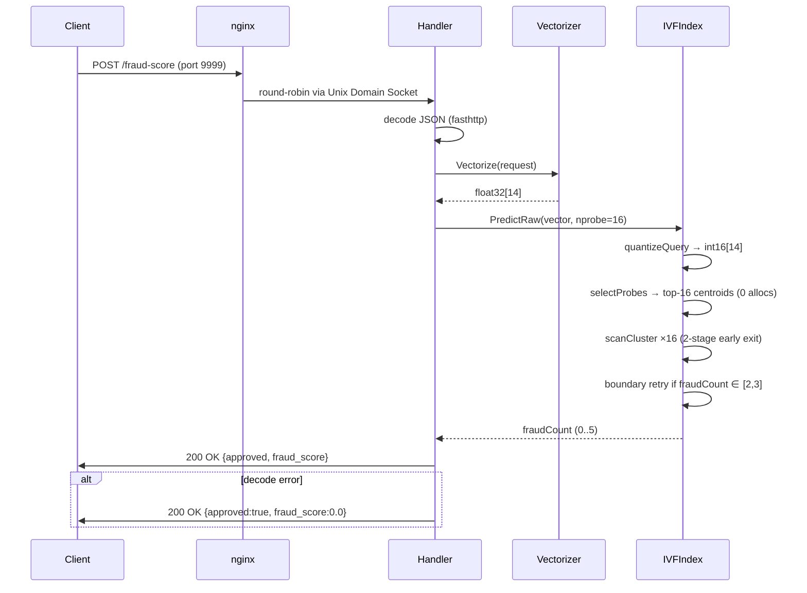
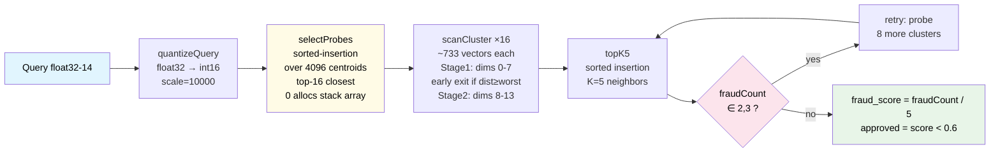
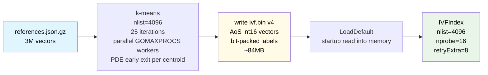

# Architecture

## Request Flow



## IVF KNN Algorithm



## Index Build (docker build time)



## ivf.bin Format (v4)

```
magic     uint32   0x49564649
version   uint32   4
nlist     uint32   4096
dim       uint32   14
n         uint32   3000000
centroids [nlist×DIM]float32   — cluster centroids
offsets   [nlist+1]uint32      — cluster boundaries
vectors   [n×DIM]int16         — AoS: vectors[i*DIM+d]
labels    [ceil(n/8)]byte      — bit-packed: bit i%8 of byte i/8
```

## Resource Allocation

| Component | CPU | Memory | Env |
|---|---|---|---|
| nginx | 0.10 | 30MB | — |
| api-1 | 0.45 | 150MB | `GOMAXPROCS=2`, `GOGC=off`, `GOMEMLIMIT=120MiB` |
| api-2 | 0.45 | 150MB | `GOMAXPROCS=2`, `GOGC=off`, `GOMEMLIMIT=120MiB` |
| **Total** | **1.00** | **330MB** | budget: 350MB |

Communication between nginx and API instances uses **Unix Domain Sockets** on a shared `tmpfs` volume — eliminates TCP loopback overhead (~40–60µs/request).

## Performance

| Path | Latency |
|---|---|
| selectProbes (4096 centroids) | ~10µs |
| scanCluster ×16 (~733 vectors each, nlist=4096) | ~60µs |
| KNN total (nlist=4096) | ~70µs (estimated) |
| KNN total (nlist=512 local benchmark) | ~566µs |
| p99 (Docker 0.45 CPU, k6, nlist=4096) | ~91ms |
| Allocations per query | **0 B/op, 0 allocs/op** |

## Score History

| Version | Official Score | Local Docker | p99 | Notes |
|---|---|---|---|---|
| v1.0.45 | 1650 | — | 112ms | nlist=300, CGo |
| v1.0.51 | 3443 | — | — | nlist=1024, CGo AVX2 |
| v1.0.52 | 3434 | — | 157ms | nlist=1024, CGo AVX2 (CPU throttled) |
| v1.0.53+ | TBD | **3949** | 91ms | IVF v4, nlist=4096, pure Go, 0 allocs |
