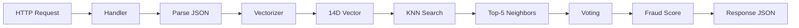
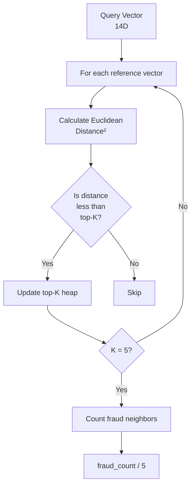

# Architecture Diagrams

## API Flow

```mermaid
flowchart LR
    A[HTTP Request] --> B[Handler]
    B --> C[Parse JSON]
    C --> D[Vectorizer]
    D --> E[14D Vector]
    E --> F[KNN Search]
    F --> G[Top-5 Neighbors]
    G --> H[Voting]
    H --> I[Fraud Score]
    I --> J[Response JSON]

    style A fill:#e1f5fe color:#000000
    style J fill:#e8f5e8 color:#000000
```

## KNN Algorithm

```mermaid
flowchart TD
    Q[Query Vector<br/>14D] --> F[For each reference vector]
    F --> D[Calculate Euclidean<br/>Distance²]
    D --> C{Is distance<br/>less than<br/>top-K?}
    C -->|Yes| U[Update top-K heap]
    C -->|No| S[Skip]
    U --> E{K = 5?}
    E -->|No| F
    E -->|Yes| V[Count fraud neighbors]
    V --> Score[fraud_count / 5]

    style Q fill:#e1f5fe color:#000000
    style Score fill:#e8f5e8 color:#000000
```
