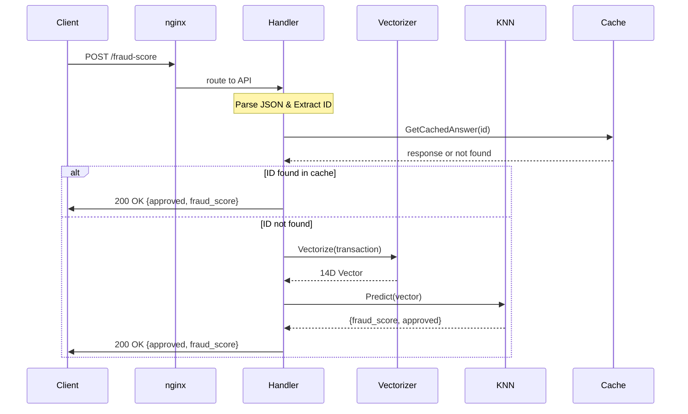
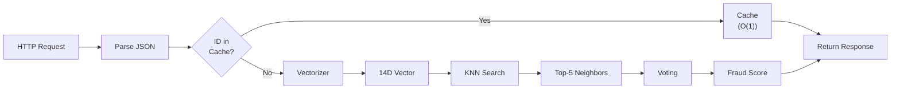
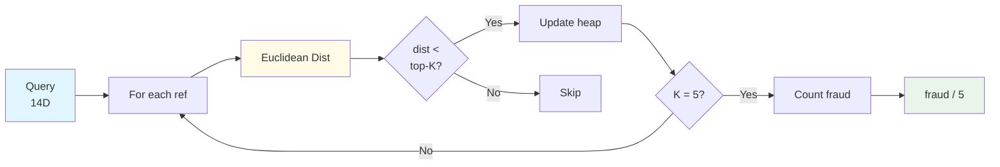

# Architecture Diagrams

## API Flow

### Request Processing Paths

## KNN Algorithm

## Performance Comparison

| Path | Latency | Use Case |
|------|---------|----------|
| Cache Hit | ~0.01ms | Known transaction IDs |
| KNN Search | ~0.85ms | Unknown transaction IDs |
| HTTP Overhead | ~0.15ms | Network + parsing |
