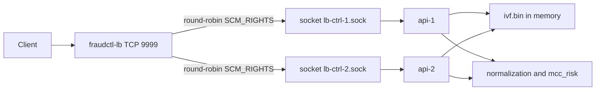
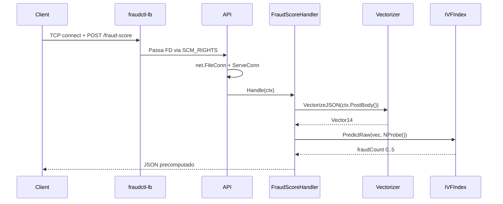
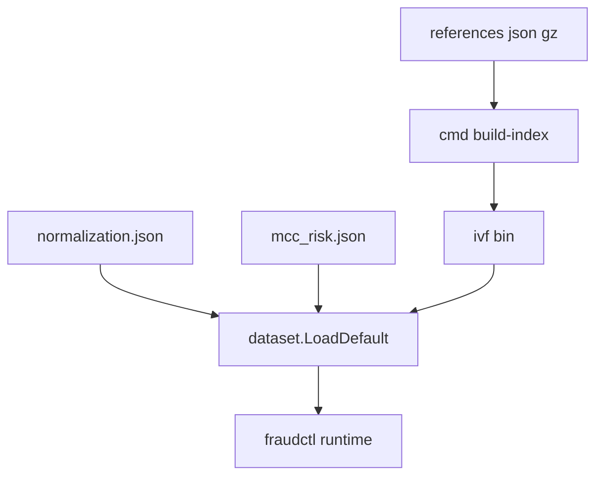

# Architecture

## Visão Geral

O caminho principal atual do projeto usa:

- `fraudctl-lb` como load balancer TCP custom
- `fasthttp` nas APIs
- `IVFIndex` carregado de `resources/ivf.bin`
- `VectorizeJSON` no hot path de requisição

## Topologia Atual

## Fluxo de Requisição

## Componentes

### API

Entrypoint: `cmd/api/main.go`

Responsabilidades:

- carregar dataset e configurações
- subir `fasthttp.Server`
- criar socket de controle Unix em `CTRL_SOCKET`
- receber FDs do LB via `SCM_RIGHTS`
- distribuir conexões para um pool de workers com `ServeConn`

Detalhes relevantes:

- endpoint `/ready` responde `200 OK` com corpo `OK`
- endpoint `/fraud-score` responde sempre JSON `200 OK`
- `TELEMETRY_ENABLED=false` desliga a telemetria periódica
- `pprof` só é exposto quando `-pprof` é informado

### Vectorizer

Arquivos principais:

- `internal/vectorizer/vectorizer.go`
- `internal/vectorizer/fast_json.go`

Responsabilidades:

- converter payload em `model.Vector14`
- usar parser JSON rápido sem desserializar a struct inteira no hot path
- normalizar 14 features com base em `normalization.json` e `mcc_risk.json`

### Dataset Loader

Arquivos principais:

- `internal/dataset/dataset.go`
- `internal/dataset/loader.go`

Responsabilidades:

- carregar `normalization.json`
- carregar `mcc_risk.json`
- priorizar `ivf.bin`
- cair para brute force apenas se `ivf.bin` não estiver disponível

Fallbacks internos atuais quando não há variáveis de ambiente:

- `IVF_NPROBE=36`
- `IVF_QUICK_PROBE=16`
- `IVF_BOUNDARY_LO=2`
- `IVF_BOUNDARY_HI=3`

### IVF KNN

Arquivos principais:

- `internal/knn/ivf_build.go`
- `internal/knn/brute.go`
- `internal/knn/ivf_search.go`

Formato atual do índice:

- versão `v5`
- vetores quantizados em `int16`
- labels bit-packed
- centroids transpostos para SoA ao carregar
- bounding boxes por cluster

### Load Balancer Custom

Entrypoint: `cmd/lb/main.go`

Responsabilidades:

- aceitar conexões TCP em `:9999`
- escolher worker por round-robin
- extrair o FD do socket TCP aceito
- encaminhar o FD para a API via `WriteMsgUnix(..., SCM_RIGHTS, ...)`

O LB atual é o caminho principal em `docker-compose.yml`.

Arquivos legados como `config/haproxy.cfg` e `config/nginx.conf` não fazem parte da topologia principal atual.

## Build-Time vs Run-Time

### Build da imagem principal

Arquivo: `Dockerfile`

O build atual:

1. compila `fraudctl`
2. compila `build-index`
3. executa `build-index -nlist 4096 -iterations 32`
4. copia `/build/resources` para a imagem final

## Observações de Estado Atual

- O README e os docs antigos citavam `nginx` ou `haproxy` como caminho principal; isso não corresponde mais ao stack atual.
- O código de `dataset` ainda sabe carregar `gbdt.bin` e `model.bin`, mas o handler atual não usa esse prefilter.
- Existe divergência entre defaults internos do pacote `dataset` e eventuais experimentos locais; a documentação desta pasta descreve o código atual, não experimentos passados.
