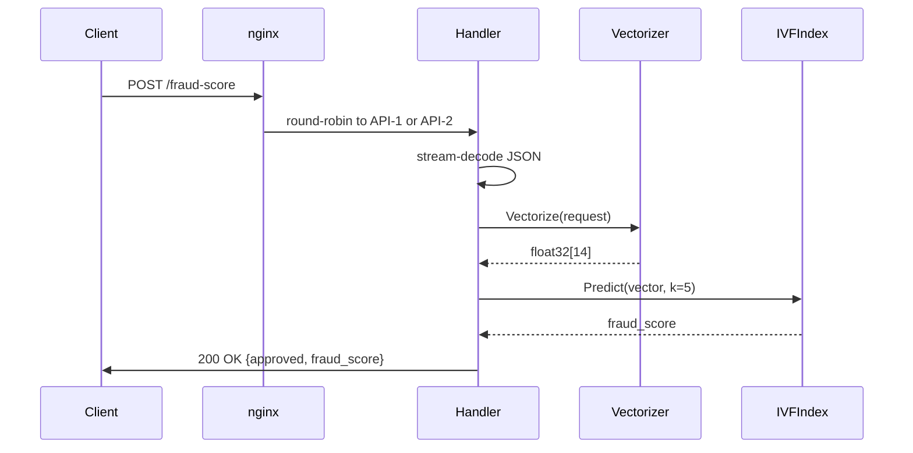
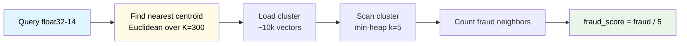
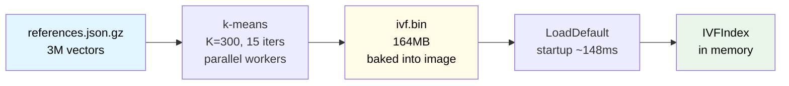

# Architecture

## Request Flow

## IVF KNN Algorithm

## Index Build (docker build time)

## Resource Allocation

| Component | CPU | Memory |
|---|---|---|
| nginx | 0.10 | 30MB |
| api-1 | 0.45 | 150MB |
| api-2 | 0.45 | 150MB |
| **Total** | **1.00** | **330MB** |

Key env vars per API instance: `GOMAXPROCS=1`, `GOGC=500`, `GOMEMLIMIT=140MiB`

## Performance

| Path | Latency |
|---|---|
| Index load (startup) | ~148ms |
| Find nearest centroid (K=300) | ~5μs |
| Scan cluster (~10k vectors) | ~62μs |
| KNN total | ~67μs |
| HTTP handler p50 | ~50μs |
| p99 (250 VUs, k6) | 170ms |
