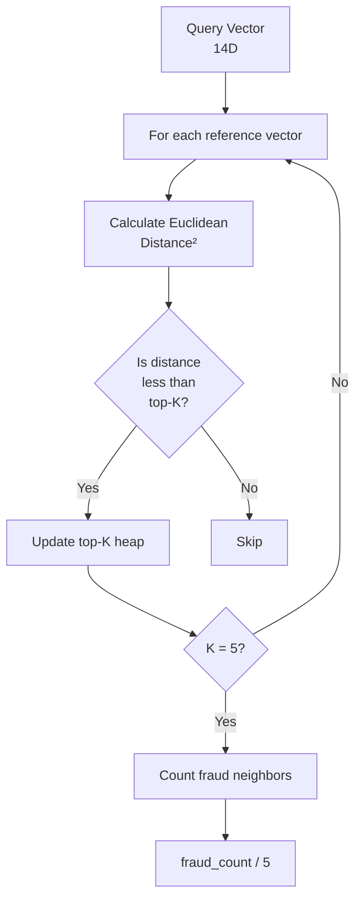

# Architecture Diagrams

## API Flow

```mermaid
sequenceDiagram
    participant C as Client
    participant N as nginx
    participant H as Handler
    participant V as Vectorizer
    participant K as KNN
    participant Ca as Cache

    C->>N: POST /fraud-score
    N->>H: route to API

    rect rgb(240, 248, 255)
        Note over H: Parse JSON & Extract ID
    end

    H->>Ca: GetCachedAnswer(id)

    alt Cache Hit
        Ca-->>H: {approved, fraud_score}
        H->>C: 200 OK
    else Cache Miss
        H->>V: Vectorize(transaction)
        V-->>H: 14D Vector
        H->>K: Predict(vector)
        K-->>H: {fraud_score, approved}
        H->>C: 200 OK
    end

    style Ca fill:#90EE90
    style K fill:#FFB6C1
```

### Request Processing Paths

```mermaid
flowchart TD
    A[HTTP Request] --> B[Parse JSON]
    B --> C{ID in Cache?}

    C -->|Yes| D[(Cache<br/>O(1) lookup)]
    D --> E[Return Response]

    C -->|No| F[Vectorizer]
    F --> G[14D Vector]
    G --> H[KNN Search]
    H --> I[Top-5 Neighbors]
    I --> J[Voting]
    J --> K[Fraud Score]
    K --> E

    style D fill:#90EE90
    style H fill:#FFB6C1
    style I fill:#FFB6C1
    style J fill:#FFB6C1
    style K fill:#FFB6C1
```

## KNN Algorithm



## Performance Comparison

| Path | Latency | Use Case |
|------|---------|----------|
| Cache Hit | ~0.01ms | Known transaction IDs |
| KNN Search | ~0.85ms | Unknown transaction IDs |
| HTTP Overhead | ~0.15ms | Network + parsing |
