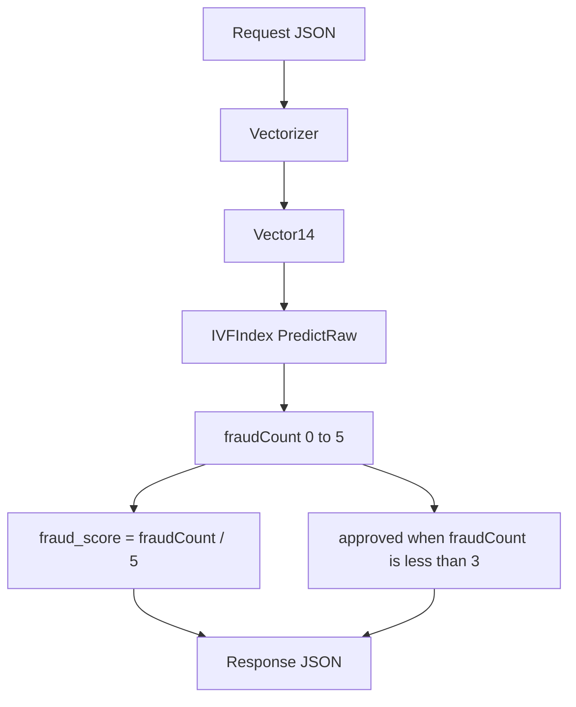
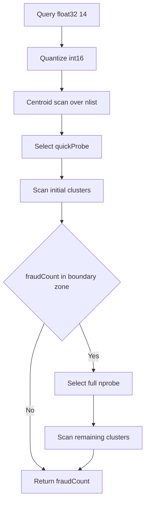

# Detection Rules

## Visão Geral

O backend transforma a transação em um vetor de 14 dimensões, busca os 5 vizinhos mais próximos no índice IVF e decide a aprovação com base na contagem de vizinhos fraudados.

## Regra de Decisão

1. vetor da transação
2. `PredictRaw` retorna `fraudCount` entre `0` e `5`
3. `fraud_score = fraudCount / 5`
4. `approved = fraudCount < 3`

## Fluxo de Decisão

## Dimensões do Vetor

| índice | feature | regra |
|---|---|---|
| 0 | `amount` | `clamp(amount / max_amount)` |
| 1 | `installments` | `clamp(installments / max_installments)` |
| 2 | `amount_vs_avg` | `clamp((amount / customer.avg_amount) / amount_vs_avg_ratio)` |
| 3 | `hour_of_day` | `hour(requested_at) / 23` |
| 4 | `day_of_week` | `weekday(requested_at) / 6` com `mon=0` |
| 5 | `minutes_since_last_tx` | `clamp(minutes / max_minutes)` ou `-1` |
| 6 | `km_from_last_tx` | `clamp(km / max_km)` ou `-1` |
| 7 | `km_from_home` | `clamp(km_from_home / max_km)` |
| 8 | `tx_count_24h` | `clamp(tx_count_24h / max_tx_count_24h)` |
| 9 | `is_online` | `1` ou `0` |
| 10 | `card_present` | `1` ou `0` |
| 11 | `unknown_merchant` | `1` se `merchant.id` nao estiver em `known_merchants` |
| 12 | `mcc_risk` | valor de `mcc_risk.json`, default `0.5` |
| 13 | `merchant_avg_amount` | `clamp(merchant.avg_amount / max_merchant_avg_amount)` |

## Regras Especiais

### `last_transaction == null`

Quando não existe transação anterior:

- `vec[5] = -1`
- `vec[6] = -1`

Esse é o único caso em que o vetor pode conter valor fora de `[0,1]`.

### Merchant conhecido

`unknown_merchant` é `0` quando `merchant.id` aparece em `customer.known_merchants`.

### MCC risk

- lookup em estrutura array de `10000` posições
- MCC inválido ou ausente cai em `0.5`

## Normalização

Os limites vêm de `resources/normalization.json`.

Campos usados:

- `max_amount`
- `max_installments`
- `amount_vs_avg_ratio`
- `max_minutes`
- `max_km`
- `max_tx_count_24h`
- `max_merchant_avg_amount`

`clamp(x)` limita o valor ao intervalo `[0.0, 1.0]`.

## Busca KNN Atual

Implementação atual em `internal/knn/ivf_search.go`.

Passos:

1. quantiza query para `int16`
2. calcula distância para todos os centroides via produto escalar + norma pré-computada
3. seleciona `quickProbe` centroides mais próximos
4. faz scan dos clusters iniciais
5. se `fraudCount` cair na zona ambígua `[boundaryLo, boundaryHi]`, amplia para `nprobe`
6. retorna a contagem final de vizinhos fraudados

## BBox Pruning

Cada cluster possui `bboxMin` e `bboxMax` por dimensão.

Antes de escanear o cluster, o código calcula um lower bound da distância entre a query e a bounding box. Se esse bound não puder melhorar o pior candidato atual do top-K, o cluster é pulado.

## Ordem de Avaliação das Dimensões

No scan dos vetores, a ordem atual prioriza early exit.

Stage 1:

- `5, 6, 2, 0, 7, 1, 3, 4`

Stage 2:

- `8, 11, 12, 9, 10, 13`

## Observações Importantes do Estado Atual

- O handler atual usa apenas KNN para a decisão.
- Embora `dataset` consiga carregar `model.bin` e `gbdt.bin`, esse resultado não é usado no caminho principal atual da API.
- O parser de JSON do hot path é manual e orientado a bytes.
