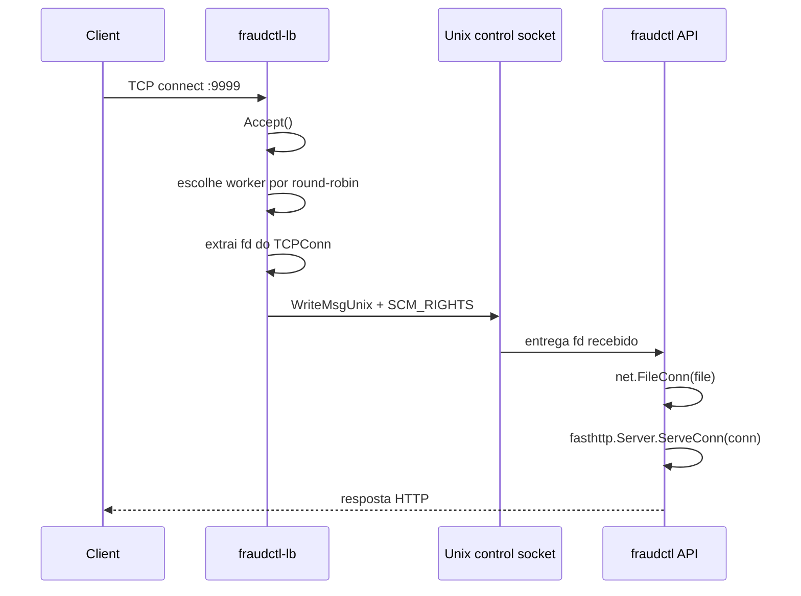
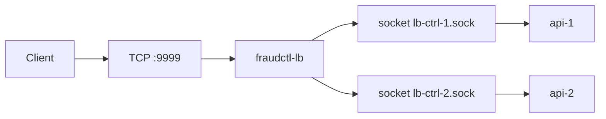

# Custom Load Balancer

## Visão Geral

O load balancer principal atual do projeto é `fraudctl-lb`, implementado em `cmd/lb`.

Ele não faz proxy HTTP. Em vez disso:

1. aceita a conexão TCP do cliente
2. escolhe uma API por round-robin
3. passa o descritor da conexão para a API via `SCM_RIGHTS`

Isso permite que a API processe a conexão diretamente com `ServeConn`.

## Por que existe

Objetivos da implementação atual:

- remover overhead de proxy HTTP entre LB e API
- manter duas instâncias de API com um único endpoint público `:9999`
- preservar baixo consumo de memória

## Fluxo do FD Passing

## Arquitetura

## Comportamento Atual

Arquivo principal: `cmd/lb/main.go`

O LB atual:

- escuta em `:9999`
- lê lista de workers de `-workers`
- mantém conexão Unix com cada worker
- usa round-robin por contador atômico
- envia `SCM_RIGHTS` com `WriteMsgUnix`
- fecha o socket TCP local depois de transferir o FD

## Lado da API

No runtime da API:

- `CTRL_SOCKET` define o socket Unix de controle
- a API faz `net.Listen("unix", CTRL_SOCKET)`
- `serveControl` recebe `SCM_RIGHTS`
- `parseUnixRights` extrai os FDs
- a conexão vira `net.Conn` com `net.FileConn`
- um worker chama `srv.ServeConn(conn)`

## Segurança Operacional

O stack atual usa:

- `tmpfs` compartilhado para `/sockets`
- `nofile=65536`
- `net.core.somaxconn=4096` no container do LB
- `GOMAXPROCS=1`

## Limitações e Observações

- O LB atual é simples: round-robin fixo, sem health routing avançado.
- A saúde dos backends é tratada principalmente pelo `docker-compose` e pelo health check da API.
- Arquivos `config/haproxy.cfg` e `config/nginx.conf` existem no repositório, mas são legados e não representam o caminho principal atual.

## Build e Imagem

Dockerfile do LB: `cmd/lb/Dockerfile`

Características:

- build em Go puro
- imagem final `distroless/base-debian12`
- `GOMAXPROCS=1`
- `GOMEMLIMIT=10MiB`

## Compose

No `docker-compose.yml` atual:

- o serviço `lb` é construído a partir de `./cmd/lb`
- o endpoint público é `9999:9999`
- os workers configurados são:
  - `/sockets/lb-ctrl-1.sock`
  - `/sockets/lb-ctrl-2.sock`

## Compliance

O LB custom não altera a lógica funcional de detecção, apenas a forma de encaminhar conexões para as APIs. Portanto, ele não introduz cache de payload, lookup proibido ou atalho de resultado.
